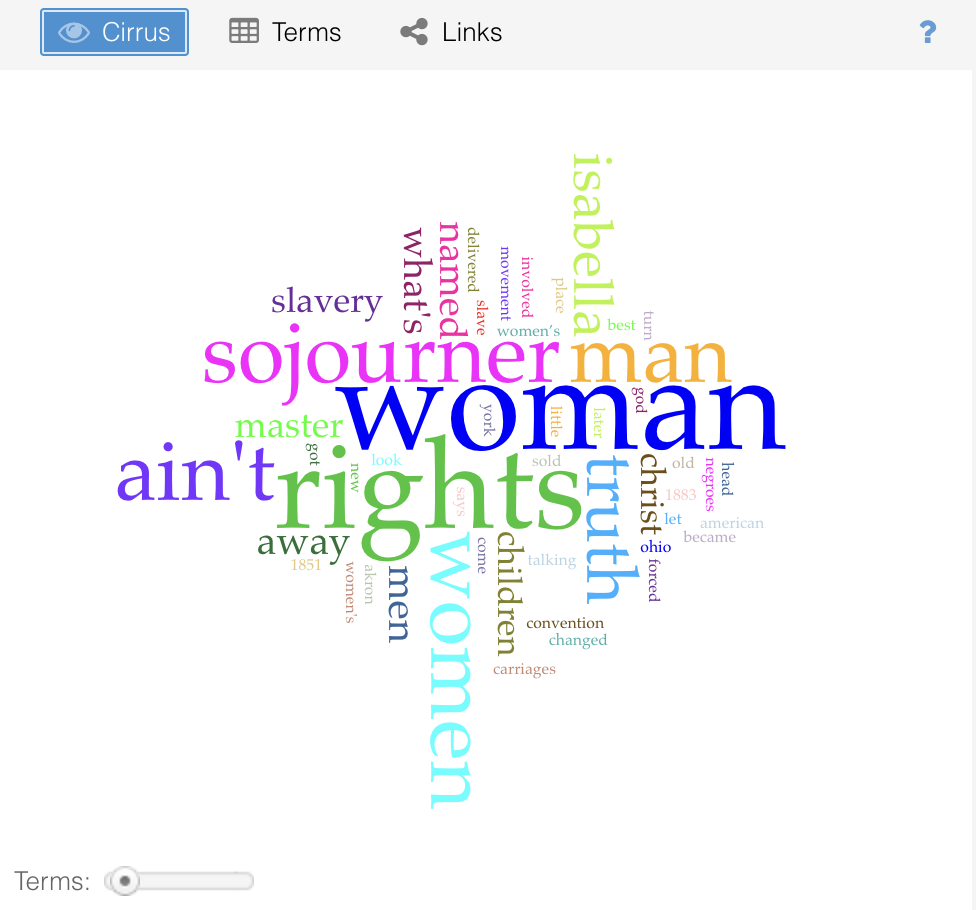
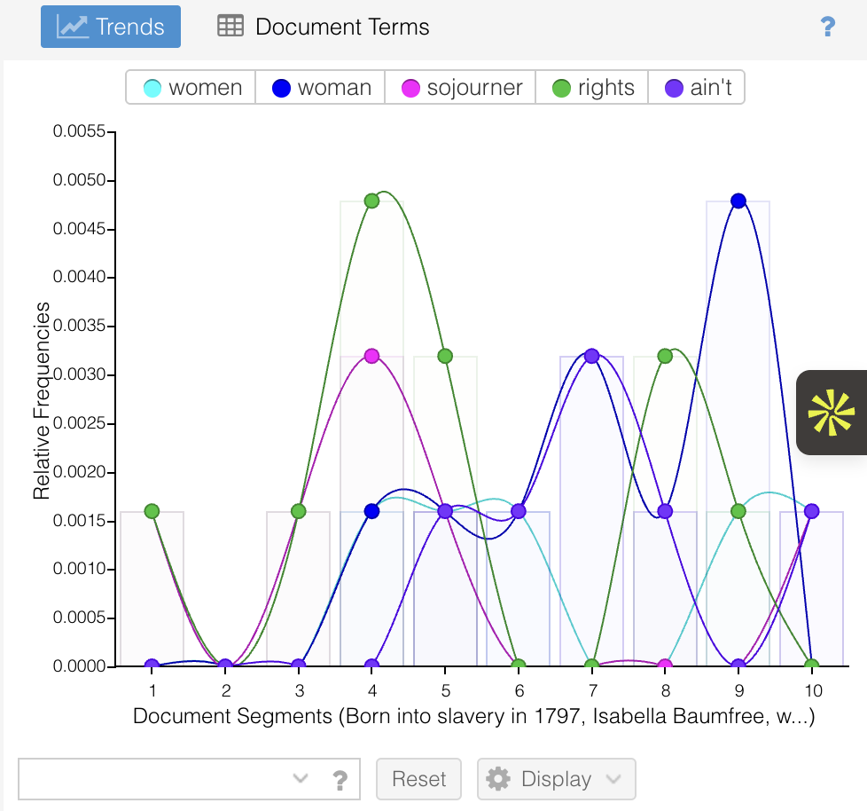

# Text Analysis

Materials for text analysis will go here.

> **Note:** Add the screenshots referenced below to `assets/images/` or another appropriate folder and update the paths if necessary.

AHI 101 — Week 6 Make: How Machines Read

*Voyant Cirrus word cloud from the speech.*

*Trend lines showing relative frequencies of key terms across segments.*
Student Name: Hung Ly
Text Analyzed: “Ain’t I a Woman?” by Sojourner Truth (1851 speech, Akron Women’s Rights Convention)

Voyant Analysis Summary
Using Voyant, I examined word frequency, trends across segments, and the Cirrus word cloud. The most frequent words were rights, woman, sojourner, ain’t, and women. The repetition of woman and rights confirms that the speech centers on gender and political recognition. The trends view showed that rights peaks in the middle of the text, while woman increases toward the later segments, suggesting a shift from biography to direct argument. The word cloud visually amplified this emphasis, with woman and rights dominating the field.
Voyant helped me see structural emphasis. It quantified repetition and showed how certain terms cluster in particular sections. However, it treated the speech as a dataset. It could not distinguish between irony, grief, or theological reversal. It showed patterns but did not explain their force.

GPT Analysis Summary
Prompt: “Give me a literary analysis of the text.”
GPT produced a rhetorical and thematic interpretation. It discussed repetition, embodiment, intersection of race and gender, tone shifts, and biblical references. It interpreted “Ain’t I a woman?” as both a logical challenge and moral confrontation. The analysis read the speech as a cohesive argument shaped by lived experience.
However, GPT did not show how it derived those interpretations unless prompted further. Its authority comes from fluency rather than visible method.

Comparison
Voyant imagines meaning as measurable frequency and distribution. Importance equals repetition. GPT imagines meaning as coherence and theme. Importance equals interpretive synthesis. Voyant is transparent but silent about significance. GPT is interpretive but opaque about process.

Reflection
This assignment made me realize that machines “read” according to their design. Voyant reads by counting and mapping. It assumes that meaning emerges from pattern density. This helps reveal emphasis and structure, especially in a speech built on repetition. But it flattens emotional intensity into data points. It cannot feel the grief in the line about children sold into slavery, nor can it recognize the strategic power of irony.
GPT reads by generating interpretation that resembles human literary analysis. It organizes themes and articulates connections across the text. This feels closer to classroom discussion. Yet it performs understanding rather than demonstrating it. It does not expose its evidence trail unless asked.
What we gain from machine reading is scale and speed. Patterns become visible instantly. What we lose is situated judgment. Neither tool experiences the historical weight of a formerly enslaved woman speaking in 1851. Meaning changes depending on method. Voyant fragments the text into units. GPT reconstructs it into argument. Human reading, however, still decides why those patterns and arguments matter.

Attribution and AI Use Statement
Text: Sojourner Truth, “Ain’t I a Woman?” 1851 speech, public domain
Tools used: Voyant Tools and ChatGPT
GPT prompt: “Give me a literary analysis of the text.”
Voyant limitation: Cannot interpret tone, irony, or historical stakes
GPT limitation: Does not reveal reasoning process and may overgeneralize without textual prompting
   
