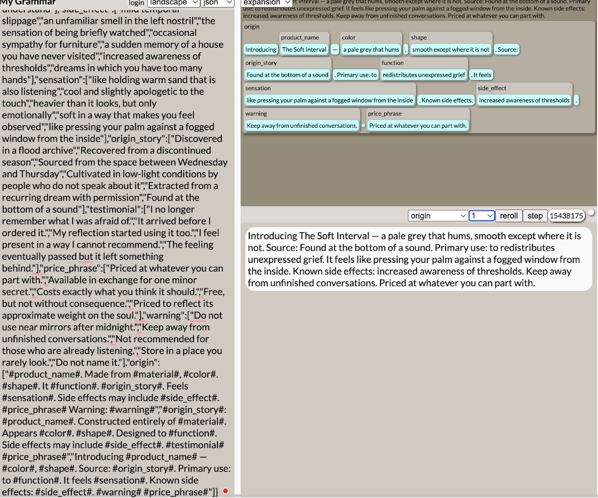

# Week 9 – Bots & Generators

## The Artifact
#1

"The Unnamed Thing. Made from compressed forgetting, translucent like an apology. A sphere that is not quite touching itself. It locates the feeling you misplaced. Extracted from a recurring dream with permission. Feels like holding warm sand that is also listening. Side effects may include an unfamiliar smell in the left nostril. Free, but not without consequence. Warning: Keep away from unfinished conversations."

Why: Every element pulls in the same emotional direction — loss, incompleteness, unresolved feeling. "Compressed forgetting" and "locates the feeling you misplaced" mirror each other perfectly. The warning at the end feels earned rather than random.

#2

"Introducing The Pale Mirror — a pale grey that hums, flat in a way that feels personal. Source: Sourced from the space between Wednesday and Thursday. Primary use: to absorbs ambient regret. It feels like pressing your palm against a fogged window from the inside. Known side effects: a sudden memory of a house you have never visited. Store in a place you rarely look. Available in exchange for one minor secret."

Why: "Pressing your palm against a fogged window from the inside" is the single most surprising sensation in the whole batch — it flips the familiar image. "The space between Wednesday and Thursday" as an origin is quietly devastating.

#3

"Found at the bottom of a sound: The Quiet Instrument. Constructed entirely of compressed forgetting. Appears translucent like an apology. Like a door that forgot what it was for. Designed to locate the feeling you misplaced. Side effects may include the sensation of being briefly watched. My reflection started using it too. Priced to reflect its approximate weight on the soul."

Why: The opening line — "Found at the bottom of a sound" — is the strongest lead in the entire set. "My reflection started using it too" is the most unsettling testimonial. Everything coheres around themes of observation and doubling.

#4

"Introducing The Slow Weight — deep bruise-violet, a sphere that is not quite touching itself. Source: Discovered in a flood archive. Primary use: to hums at frequencies only basements understand. It feels heavier than it looks, but only emotionally. Known side effects: mild temporal slippage. Not recommended for those who are already listening. Costs exactly what you think it should."

Why: "Heavier than it looks, but only emotionally" is the funniest and most emotionally precise line in the batch — it earns its humor while still landing as genuinely melancholy. "Hums at frequencies only basements understand" is surprisingly coherent with the rest.

#5

"Introducing The Tender Absence — deep bruise-violet, a sphere that is not quite touching itself. Source: Extracted from a recurring dream with permission. Primary use: to softens the edges of recent events. It feels cool and slightly apologetic to the touch. Known side effects: increased awareness of thresholds. Do not name it. Priced to reflect its approximate weight on the soul."

Why: "Cool and slightly apologetic to the touch" is a surprising sensory combination that somehow works perfectly. "Do not name it" as the sole warning, with nothing else, is the most restrained and therefore most unnerving use of that field.

#6

"Introducing The Second Mouth — the shade of 3am, like a door that forgot what it was for. Source: Extracted from a recurring dream with permission. Primary use: to redistributes unexpressed grief. It feels heavier than it looks, but only emotionally. Known side effects: a sudden memory of a house you have never visited. Do not name it. Free, but not without consequence."

Why: "Redistributes unexpressed grief" sounds bureaucratic and clinical in a way that makes it more unsettling, not less. The combination of "a house you have never visited" with "Free, but not without consequence" creates a genuinely eerie closing.

#7

"The Soft Interval. Made from refined waiting, translucent like an apology. Roughly oval, though it changes. It softens the edges of recent events. Recovered from a discontinued season. Feels heavier than it looks, but only emotionally. Side effects may include an unfamiliar smell in the left nostril. Free, but not without consequence. Warning: Keep away from unfinished conversations."

Why: "Recovered from a discontinued season" is the most poetic origin story in the set — surprising but immediately legible as meaningful. "Refined waiting" as a material is conceptually strong and unexpected.

## Process Notes
Process Documentation (~300 words)
I built my generator using Tracery, a grammar-based text generation tool, accessed through the editor at tracery.io. The concept I chose was surreal product descriptions: fake listings for objects that don't exist, written in the style of a catalog for things that deal in emotion, memory, and dread rather than function.
The grammar I constructed contains 12 symbols: product_name, material, color, shape, function, side_effect, sensation, origin_story, testimonial, price_phrase, warning, and origin. The origin symbol is the root, the sentence template that calls all other symbols and assembles them into a full product description. I built three distinct sentence templates into origin so that outputs vary structurally, not just lexically. Some begin with the product name, some with the origin story, and some open with "Introducing," mimicking different registers of advertising copy.
Each symbol contains between 5 and 8 options, which I wrote with a specific tonal target in mind: unsettling and dreamy, leaning on emotional abstraction rather than concrete imagery. Materials are things like "compressed forgetting" and "woven sleep residue." Functions include "redistributes unexpressed grief" and "dissolves minor certainties." I wanted every field to feel like it belonged to the same emotional vocabulary even when combined randomly.
I generated approximately 60 outputs in total by repeatedly clicking the regenerate button in the Tracery editor and copying results into a running document. The generation process was fast, producing a new description instantly with each click, which created an odd rhythm of reading, evaluating, and discarding. Many outputs were coherent but unremarkable; some were repetitive in ways that felt flat. I stopped generating when I felt I had enough variety to curate from meaningfully, settling on 7 final selections from the pool of 60.

## Reflection
Artist Statement (~250 words)
The creative decisions in this project were not made when I wrote the grammar, or not only then. They were made in the moments I stopped clicking. Curation, I found, is its own kind of authorship: slower, more uncomfortable, and more revealing than generation.
Building the grammar felt like setting rules for a language I wanted to exist. I made deliberate choices about tone, writing every word list toward the same emotional register, the same dreamy unease. In that sense, the system reflects a sensibility even before it produces a single output. The machine does not have taste, but it inherits mine.
What I did not anticipate was how quickly novelty exhausted itself. After about twenty outputs, I stopped being surprised by individual combinations and started evaluating them against each other. I was no longer asking "is this interesting?" but "is this the most interesting version of this idea?" That shift felt significant. The question stopped being about generation and started being about judgment.
Where is the human in generative work? I think the honest answer is: everywhere except the middle. I defined the inputs, I selected the outputs, and everything in between was a process I set in motion but did not control. The outputs I chose share something the rejected ones didn't. They have a feeling of internal coherence, where each random combination somehow confirms the others. That coherence was never programmed. It was noticed. And noticing, I think, is still a human act, for now.

## Attribution & AI Use
Attribution
This generator was built using Tracery, a free grammar-based text generation tool available at tracery.io. All grammar rules, word lists, and sentence templates were written by me and entered into the Tracery editor as a JSON file. The grammar contains 12 symbols and 3 output templates, which the tool uses to randomly combine elements into complete product descriptions. No AI writing tools were used to generate the final curated outputs. The outputs are the direct product of the Tracery grammar I constructed, selected and annotated by me.
